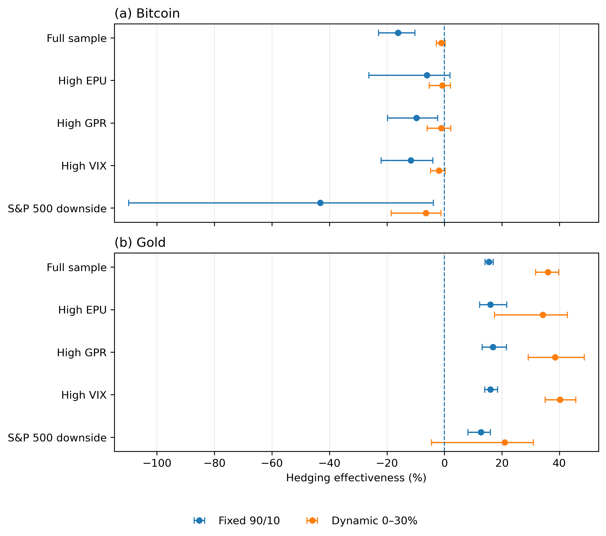

# Bitcoin vs Gold as Defensive Assets

**Dynamic correlation, uncertainty regimes and portfolio evidence using Bitcoin, gold and the S&P 500, 2021–2026.**

This project investigates whether Bitcoin can provide defensive portfolio value comparable to gold during periods of **economic policy uncertainty, geopolitical risk and broader market stress**.

Rather than relying on correlation alone, the analysis connects:

**Return response → Time-varying correlation → Portfolio risk reduction**

---

## Key Findings

### Gold provided substantially stronger defensive value than Bitcoin

| Result | Bitcoin | Gold |
|---|---:|---:|
| Mean DCC with S&P 500 | **0.352** | **0.158** |
| Correlation ever negative? | No | Yes, ~13.7% of days |
| Dynamic portfolio hedging effectiveness | **-1.10%** | **36.01%** |
| Dynamic portfolio volatility | 16.95% | **13.48%** |
| Dynamic portfolio Sharpe ratio | 0.669 | **0.923** |

Bitcoin remained positively correlated with the S&P 500 throughout the sample and provided **no reliable reduction in portfolio variance**.

Gold had a much weaker equity relationship and delivered substantial portfolio-risk reduction, especially in the dynamic minimum-variance strategy.

### Portfolio Hedging Effectiveness


> **Lower correlation alone is not enough — defensive value matters only when it translates into lower portfolio risk.**

The portfolio results show this particularly clearly: a fixed 10% Bitcoin allocation increased variance by **16.16%**, while dynamic gold reduced variance by approximately **36%**.

---

## Research Questions

The project examines two related questions:

1. How do Bitcoin and gold returns respond to changes in **Economic Policy Uncertainty (EPU)** and **Geopolitical Risk (GPR)**?
2. Do either asset's changing relationships with equities translate into meaningful portfolio protection?

The final sample contains **1,315 daily observations from 5 January 2021 to 31 March 2026**.

---

## Methodology

The analysis follows a multi-stage quantitative framework:

```text
Market & Uncertainty Data
          ↓
Return Diagnostics
          ↓
OLS-HAC / Quantile Analysis
          ↓
GARCH-Family Model Selection
          ↓
Dynamic Conditional Correlation
          ↓
Uncertainty & Stress Regimes
          ↓
Portfolio Optimisation
          ↓
Bootstrap Risk Evaluation
